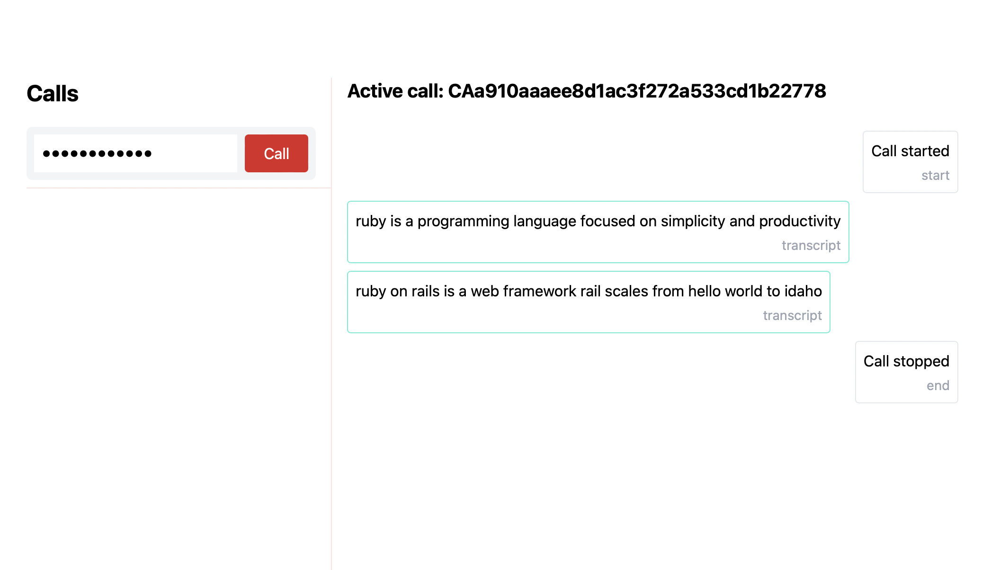

# AnyCable + Twilio Media Streams + Hanami

This repository contains example applications demonstrating how to build phone calls processing pipelines with [Twilio Media Streams][], [AnyCable-Go][] and Ruby ([Hanami][]).

> Read more in the ["AnyCable off Rails: connecting Twilio streams with Hanami"](https://evilmartians.com/chronicles/anycable-goes-off-rails-connecting-twilio-streams-with-hanami) blog post.

The example application peforms speech recognition (via [Vosk][]) and shows results in a web browser.

## Quick start (w/ Twilio)

You need a Twilio account and a phone number to use this demo. Create one, copy the `.env.sample` into `.env` (within the `kaisen` folder) and populate with the required Twilio information.

Then, start all the components:

- Start Ngrok: `ngrok http 8080`.
- Start Hanami application with NGrok url provided: `(cd kaisen && TWILIO_CABLE_URL=wss://<some-id>.ngrok.io/streams hanami server)`. **IMPORTANT**: The url must have `wss://` scheme and `/streams` path.
- Start Vosk server: `(cd twilio-cable && make vosk-server)` (you can use the fake server, too, see below).
- Start AnyCable server: `(cd twilio-cable && make run)`.

Now, open a browser at [localhost:2300](http://localhost:2300), type in your phone number into the form and click "Call". Wait for the call, pick up the phone, and start talking—the logs should appear in the browser!

## Very quick start (no Twilio, no Docker)

You can play with this application without Twilio access by emulating media streams via [wsdirector][].

First, start all the components:

- Start Hanami application: `(cd kaisen && hanami server)`.
- Start Vosk fake server: `(cd twilio-cable && make vosk-fake-server)`.
- Start AnyCable server: `(cd twilio-cable && make run)`.

Now, you can emulate a phone call and watch the real-time logs in the browser:

- Open [localhost:2300](http://localhost:2300)
- Run wsdirector: `(cd twilio-cable && make wsdirector)`.

See the logs in the browser!

[Twilio Media Streams]: https://www.twilio.com/docs/voice/api/media-streams
[AnyCable-Go]: https://github.com/anycable/anycable-go
[Hanami]: https://hanamirb.org
[wsdirector]: https://github.com/palkan/wsdirector
[Vosk]: https://github.com/alphacep/vosk-server
